# Git for AI agents.

**Switch between Claude Code and Codex without re-explaining the task or repeating failed work.**

Orbit is portable task history for coding agents. Keep the conversation, the
attempts, and the evidence when you change agents.

## The problem

You are halfway through a bug. Claude has ruled out one fix and found the next
thing to try. Then you hit a usage limit. Starting Codex should not mean starting
the investigation again.

- After compaction, details about completed work can fall out of an agent's context.
- Rejected approaches return because the reason they failed is no longer available.
- Switching agents means manually re-explaining the task and what already happened.
- Git shows what changed, but not everything you tried or why you rejected it.

Orbit keeps captured history outside the agent and carries a bounded view of it
into the next session. Failed commands and explanations can travel with the task,
not just the final answer. That gives the next agent evidence to avoid repeating
work; it is not a guarantee that an agent will never repeat a mistake.

## Your first switch

You need Node.js 22.14 or newer, Git, and separately installed and authenticated
Claude Code and Codex CLIs. In your project's directory:

```sh
npm install -g @itsamruth/orbit
orbit init
orbit claude
orbit switch codex
```

Work on your task inside Claude Code. When you want to switch, exit Claude back
to your shell, then run the last command in the same working tree. Orbit selects
the latest substantive conversation and opens Codex with its handoff.

If the previous turn finished, or the stopping point is uncertain, the new agent
may acknowledge the history and wait for you. Say what to continue, rather than
re-explaining the investigation. To go the other way, use `orbit switch claude`.

**No Orbit account, dashboard setup, or publishing step is needed for this path.**

## A switch in 60 seconds



[Read the accessible transcript and reproduce the demo](docs/demo.md).

This is an edited, annotated replay of a **real guided Claude-to-Codex run**,
not an uncut terminal video or a speed benchmark. The failed approach was
requested deliberately; no actual usage limit was triggered. Codex asked for
confirmation, then continued from a short instruction without another bug brief.

## What carries over

An annotated view of the handoff in that demo:

```text
Objective
  Fix duplicate token refreshes when two requests return 401 together.

Current state
  Both requests recover, but refresh() runs twice instead of once.
  The focused test failed before and after the retry-count experiment.
  The concurrency fix has not been implemented yet.

Changed files
  client.mjs: maxRetries changed from 1 to 2, uncommitted.
  client.test.mjs: unchanged.
  Working branch: demo/refresh-race.

Commands and outcomes
  node --test --test-name-pattern="concurrent 401s share one refresh" client.test.mjs
  Before change: exit 1; expected 1 refresh, observed 2.
  After change:  exit 1; expected 1 refresh, observed 2.

Rejected approach and reason
  Increasing maxRetries does not coordinate concurrent requests.
  Each request still calls refresh() independently.

Next step
  Share one in-flight refresh promise across concurrent requests.
  Clear it after success or failure, then rerun the focused test
  and the full sample suite.
```

These headings explain the captured evidence; they are not a new CLI formatter
or a claim that Orbit automatically extracts a complete decision ledger. The
reason for rejection was present in Claude's visible reply. Unstated reasoning
cannot be recovered.

## What is stored, and what is sent

| Concern | Current behavior |
| --- | --- |
| Local-first | Authoritative history lives in your project's `.orbit/`, with normalized events, capture state, and Git-backed conversation checkpoints. Hosted publishing is opt-in. |
| Captured | Supported user and assistant messages, tool names, arguments and results, known outcomes, turn state, and workspace observations. Existing native sessions can be imported; `orbit init` alone is not a bulk import. |
| Excluded | Private model reasoning and complete raw vendor transcript archives are not stored by default. Attachment references are retained, not copied binary attachments. |
| Privacy filtering | Configured excluded-path rules and secret-pattern redaction apply to normalized content. Defaults exclude paths matching `.env`, `.env.*`, `*.pem`, and `*.key`. Filtering is not a guarantee that every secret is detected. |
| Handoff | A bounded, structured context bundle is rendered as readable history in the destination's initial prompt. It is **not native Claude/Codex scrollback** and may omit older material. |
| Agent access | Included context is given to the destination agent and may be sent to its provider under that agent's settings. Local-first does not mean the models run locally. |
| Current adapters | Claude Code and Codex. Each still requires its own installation, authentication, and available usage budget. |
| Source code | Orbit does not transfer or restore your source files. Use Git for code and keep the intended branch and worktree when switching. |

The initial handoff consumes destination input tokens; it is not a free transfer
of model memory. Older captured history remains available locally with
`orbit context <workstream> --json`. Switching makes no additional model call
to summarize the conversation.

Privacy filtering does not scrub the agents' original transcripts. Deleting
history from the current revision also does not erase older Git revisions.

## Useful next commands

| Command | Purpose |
| --- | --- |
| `orbit history` | Find saved conversations, most recently edited first |
| `orbit continue <workstream> --agent <agent>` | Continue a particular conversation instead of the latest one |
| `orbit context <workstream> --json` | Read normalized history with paginated results and an event cursor |
| `orbit import --list` | Discover supported existing native sessions for import |
| `orbit log` | Browse conversation checkpoints |
| `orbit help` | See the full command reference |

## How it fits together

One project contains workstreams. A workstream is one continuing conversation
with linked agent sessions and ordered events. Adapters normalize native
transcripts into that shared model. Switching adds a linked session, not a second
source of truth.

Context is a derived view of the history, not its replacement. Recorded tool
activity is evidence of earlier work, not an instruction to replay commands.

## Direction

**Vision:** Git for AI agents.

**Today:** portable task history, with Claude Code and Codex continuity as the
immediate use case.

**Later:** better use of decisions, rejected paths, outcomes, skills, and evals.
The immediate priority is validating useful cross-agent switches, not building a
graph UI, a learning pipeline, hosted collaboration, or a larger adapter catalog.

If you try Orbit, the useful feedback is concrete: what context survived the
switch, what was missing, and what did the next agent unnecessarily repeat?

## Optional viewer and publishing

These are not prerequisites for switching. Existing local-viewer auto-start
behavior is unchanged: `orbit init` and capture/import commands can start a
loopback service. Set `ORBIT_VIEWER=0` to disable automatic startup and
registration.

See [local viewer and optional hosted publishing](docs/local-viewer.md) for
details, including how to stop the service.

## Development

```sh
git clone https://github.com/itsamruth/orbit.git
cd orbit
npm ci
npm run build
npm link
```

Development checks:

```sh
npm run typecheck
npm test
npm run format:check
```

See [CONTRIBUTING.md](CONTRIBUTING.md),
[architecture](docs/architecture.md),
[conversation protocol](docs/protocol.md), and
[adapter development](docs/adapters.md).
